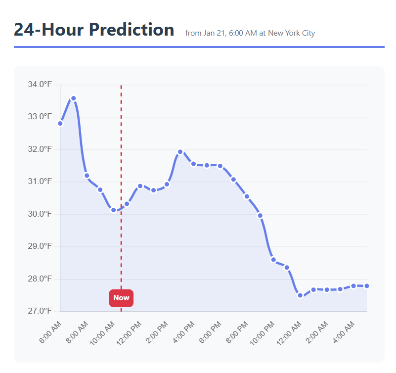
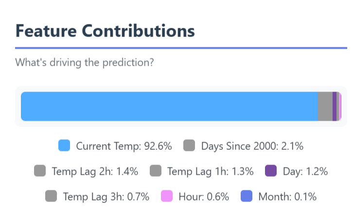
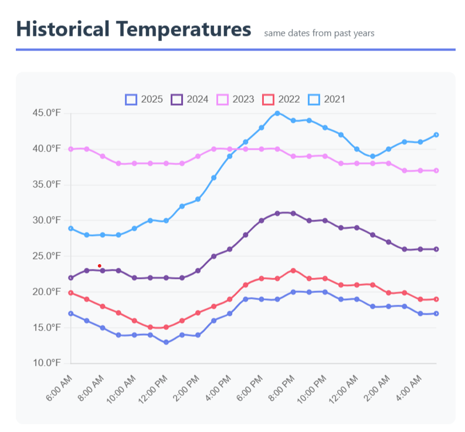
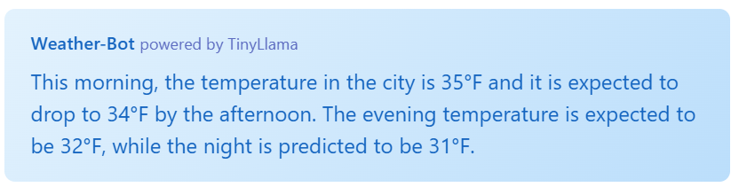

# project-weather

Temperature prediction using XGBoost with a Flask web dashboard and LLM-powered forecast summaries.

## Model

Predicts hourly temperature using an XGBoost regressor trained on historical ASOS data from Iowa State Mesonet. The model uses the following features:

| Feature | Description |
|---------|-------------|
| `ft_month` | Month (1-12) |
| `ft_day` | Day of month (1-31) |
| `ft_hour` | Hour of day (0-23) |
| `ft_days_since_2000` | Days elapsed since Jan 1, 2000 (captures long-term trends) |
| `ft_temp` | Current temperature (°F) |
| `ft_temp_lag_1h` | Temperature 1 hour ago |
| `ft_temp_lag_2h` | Temperature 2 hours ago |
| `ft_temp_lag_3h` | Temperature 3 hours ago |

The number of lag features is configurable in `conf/base/parameters.yml`. Features can be toggled on/off via the `feature_columns` list.

## SHAP Feature Contributions

The dashboard displays SHAP (SHapley Additive exPlanations) values showing how each feature contributes to the prediction. This provides interpretability into which factors are driving the forecast at any given time.

## Historical Comparison

Predictions are displayed alongside historical temperature profiles from the same calendar date in previous years, providing context for how current conditions compare to past patterns.

## Weather-Bot

The dashboard includes an LLM-powered assistant that generates natural language summaries of the 24-hour forecast. It uses TinyLlama (1.1B parameters) to produce short, readable descriptions like:

> "Temperatures will rise to 42°F this afternoon before dropping to 28°F overnight."

The model weights are stored locally in `data/05_ai/tinyllama/` after running the setup notebook.

## Web Dashboard

The Flask-based dashboard provides:

- **Current conditions** fetched live from the NWS weather.gov API
- **24-hour temperature forecast** displayed as an interactive chart
- **Historical profiles** showing same-date temperatures from past years
- **SHAP visualization** as a stacked bar showing feature contributions
- **Weather-Bot summary** with natural language forecast description
- **Technical details** panel showing model configuration and data sources

The dashboard auto-updates hourly, fetching new weather data and storing temperatures to build up the lag feature history needed for predictions.

## Data Sources

| Source | Usage |
|--------|-------|
| Iowa State Mesonet ASOS | Historical training data |
| NWS weather.gov API | Live inference data |

## Configuration

All model parameters, feature selection, and location settings are configured in `conf/base/parameters.yml`. The Kedro pipeline handles data engineering (feature extraction, lag creation) and model training with SHAP plot generation.
